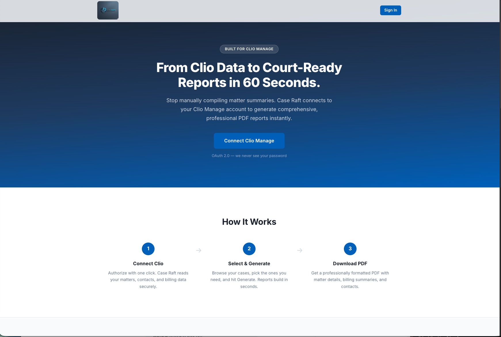

# Case Raft

A web application for solo law firm attorneys that connects to **Clio Manage** via OAuth, pulls case and client data, and generates downloadable PDF reports.

🌐 **Live at [caseraft.com](https://caseraft.com)**



## Features

- **Clio Manage Integration** — OAuth 2.0 authentication with automatic token refresh
- **Case Management** — Browse open, pending, and closed matters pulled live from Clio
- **Search & Filter** — Find cases by number, description, or client name with status tabs
- **Batch Report Generation** — Select multiple cases and generate reports in bulk (up to 20)
- **Comprehensive PDF Reports** — Generate case summary PDFs that include:
  - Matter details (status, dates, billing method, practice area, attorneys)
  - Client information (name, type, contact details)
  - Opposing parties and opposing counsel
  - Court contacts (judges, clerks, magistrates)
  - Billing summary (total billed, paid, outstanding balance, hours breakdown)
  - Invoice history and time/expense entries
- **Report History** — Track and re-download previously generated reports

## Tech Stack

| Layer        | Technology                                  |
|--------------|---------------------------------------------|
| Frontend     | React 19, Vite, React Router                |
| Backend      | Flask, SQLAlchemy, Flask-Migrate (Alembic)  |
| Database     | PostgreSQL (production) / SQLite (local dev) |
| PDF Engine   | WeasyPrint (HTML/CSS to PDF)                |
| Auth         | OAuth 2.0 with Clio Manage API v4           |
| Deployment   | Docker, Gunicorn, Railway                   |
| Domain       | caseraft.com (Vercel DNS → Railway)         |

## Project Structure

```
case-raft/
├── backend/
│   ├── app/
│   │   ├── __init__.py          # Flask app factory, CORS, blueprint registration
│   │   ├── config.py            # Environment-based configuration
│   │   ├── extensions.py        # SQLAlchemy instance
│   │   ├── models/
│   │   │   ├── user.py          # User model (Clio tokens, email)
│   │   │   └── report_history.py # Generated report tracking
│   │   ├── routes/
│   │   │   ├── auth.py          # OAuth login, callback, logout, status
│   │   │   ├── cases.py         # Case listing and detail endpoints
│   │   │   └── reports.py       # Report generation, history, download
│   │   ├── services/
│   │   │   ├── clio_client.py   # Clio Manage API v4 wrapper
│   │   │   ├── case.py          # Data models (Case, Client, Bill, Activity, etc.)
│   │   │   └── report.py        # PDF generation with WeasyPrint
│   │   └── templates/
│   │       └── case_summary.html # Jinja2 HTML template for PDF reports
│   ├── migrations/              # Alembic database migrations
│   ├── requirements.txt
│   ├── run.py                   # App entry point
│   └── start.sh                 # Production startup script
├── frontend/
│   ├── src/
│   │   ├── App.jsx              # Router and layout
│   │   ├── pages/
│   │   │   ├── Login.jsx        # Landing page with OAuth login
│   │   │   ├── Cases.jsx        # Matter list with search, filters, batch select
│   │   │   ├── CaseDetail.jsx   # Full case view + report generation
│   │   │   └── History.jsx      # Report history and downloads
│   │   └── services/
│   │       └── api.js           # Axios API client
│   ├── vite.config.js
│   └── package.json
├── Dockerfile                   # Multi-stage build (Node + Python)
├── railway.json                 # Railway deployment config
└── .dockerignore
```

## API Endpoints

### Authentication

| Method | Path              | Description                     |
|--------|-------------------|---------------------------------|
| GET    | `/auth/login`     | Initiates Clio OAuth flow       |
| GET    | `/auth/callback`  | Handles OAuth redirect callback |
| GET    | `/auth/status`    | Returns current auth status     |
| POST   | `/auth/logout`    | Clears session                  |

### Cases

| Method | Path                | Description                          |
|--------|---------------------|--------------------------------------|
| GET    | `/api/cases`        | List matters (filter by status)      |
| GET    | `/api/cases/:id`    | Get full matter details from Clio    |

### Reports

| Method | Path                            | Description                        |
|--------|---------------------------------|------------------------------------|
| POST   | `/api/reports/generate`         | Generate a PDF report for a case   |
| POST   | `/api/reports/generate-batch`   | Generate reports for multiple cases (max 20) |
| GET    | `/api/reports/history`          | List all generated reports         |
| GET    | `/api/reports/:id/download`     | Download a generated PDF           |

## Clio API Integration

The app connects to **Clio Manage** (not Clio Grow/Platform) using the v4 API at `app.clio.com`. The `ClioAPIClient` handles:

- **Matters** — list and detail with nested client, practice area, attorneys
- **Related Contacts** — opposing parties, opposing counsel, judges, clerks (categorized by relationship description)
- **Bills** — invoices with status, amounts, dates
- **Activities** — time entries and expenses with hours, rates, billing status
- **Token Refresh** — automatically refreshes expired OAuth tokens with 5-minute buffer
- **Rate Limiting** — automatic retry with Retry-After header support

## Local Development

### Prerequisites

- Python 3.11+
- Node.js 20+
- A Clio Manage developer account with an app registered at [developers.clio.com](https://developers.clio.com)

### Backend Setup

```bash
cd backend
python -m venv venv
source venv/bin/activate
pip install -r requirements.txt

# Create .env file
cat > .env << EOF
SECRET_KEY=your-secret-key
DATABASE_URL=sqlite:///caseraft.db
CLIO_CLIENT_ID=your-clio-client-id
CLIO_CLIENT_SECRET=your-clio-client-secret
CLIO_REDIRECT_URI=http://localhost:5000/auth/callback
EOF

# Run migrations and start server
flask db upgrade
flask run
```

### Frontend Setup

```bash
cd frontend
npm install
npm run dev
```

The Vite dev server runs on `http://localhost:5173` and proxies `/auth` and `/api` requests to the Flask backend on port 5000.

## Production Deployment (Railway)

The app deploys to Railway using a multi-stage Dockerfile:

1. **Stage 1** — Builds the React frontend with Node.js
2. **Stage 2** — Installs Python dependencies and WeasyPrint system libraries, copies the built frontend, and runs Flask via Gunicorn

### Railway Environment Variables

| Variable             | Description                                |
|----------------------|--------------------------------------------|
| `DATABASE_URL`       | PostgreSQL connection string (from Railway Postgres addon) |
| `SECRET_KEY`         | Flask session signing key                  |
| `CLIO_CLIENT_ID`     | Clio developer app client ID               |
| `CLIO_CLIENT_SECRET` | Clio developer app client secret           |
| `CLIO_REDIRECT_URI`  | `https://caseraft.com/auth/callback`       |

### Deploy

Push to `main` — Railway auto-deploys on every push.

## Database Schema

**users**
- `id`, `email`, `clio_access_token`, `clio_refresh_token`, `token_expires_at`, `created_at`, `updated_at`

**report_history**
- `id`, `user_id` (FK), `case_id`, `case_name`, `report_type`, `file_path`, `generated_at`

Case and client data is fetched live from Clio on each request and is not stored locally.

## License

Private — All rights reserved.
